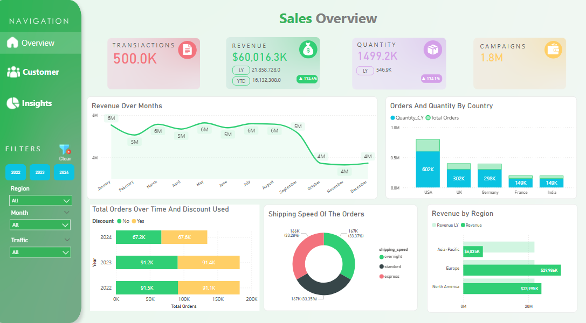
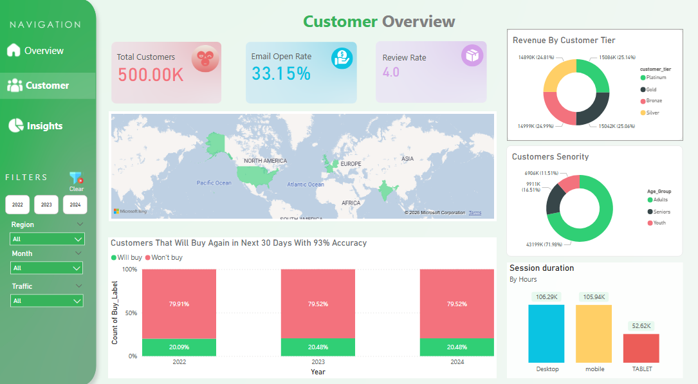
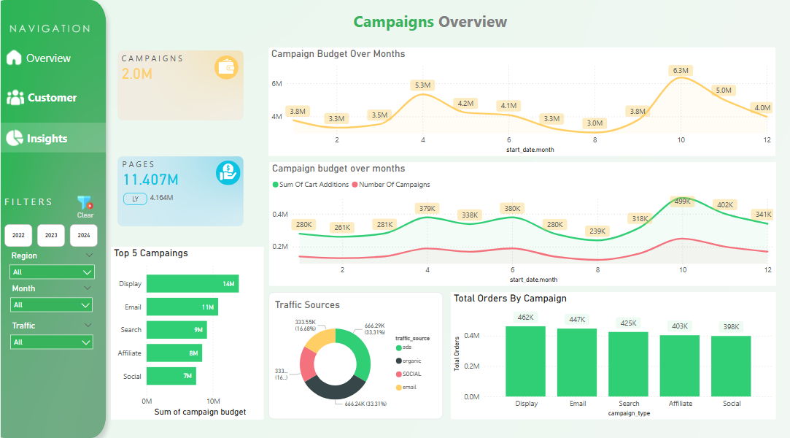

# 📊 Final Capstone Project – Orange Digital Center Internship

An end-to-end **Power BI analytics solution** that combines sales, customer, and marketing insights with **machine learning** to support data-driven business decisions. The dashboard delivers interactive reporting, KPI monitoring, and predictive customer analytics within a single business intelligence platform.

## 📁 Repository Structure

```text
Analytics_Project/
│
├── Datasets/
│   ├── Raw Data/
│   │   ├── Sales
│   │   ├── Customers
│   │   └── Campaigns
│   └── Data_Cleaned.xlsx
│
├── Power BI Project/
│   └── Analytics_Hub.pbix
│
├── Screenshots/
│   ├── pic_sales.PNG
│   ├── pic_customer.PNG
│   └── pic_campaigns.PNG
│
└── README.md
```
## 👁️ Visual Showcase

<div align="center">
  <table>
    <tr>
      <td align="center"><b>💰 Sales Overview</b></td>
      <td align="center"><b>👥 Customer Overview</b></td>
      <td align="center"><b>🎯 Campaign Overview</b></td>
    </tr>
    <tr>
      <td>
        
      </td>
      <td>
        
      </td>
      <td>
         
      </td>
    </tr>
  </table>
</div>

---

#  AI & Machine Learning Integration

One of the standout features of this project is the integration of **predictive analytics** into the Power BI reporting workflow.

## 🔮 Customer Purchase Prediction

A machine learning classification model predicts whether a customer will make another purchase within the next **30 days**.

### Model Performance

| Metric | Value |
|---------|-------|
| Prediction Target | Repeat purchase within 30 days |
| Model Accuracy | **93%** |
| Business Insight | Approximately **20%** of customers are predicted to repurchase within the next 30 days |

### Business Value

The predictive model enables marketing teams to identify high-intent customers, personalize campaigns, improve retention strategies, and maximize marketing ROI.

---

# 📈 Dashboard Overview

The dashboard consists of **3 interactive report pages**.

---

# 💰 Sales Overview

Provides visibility into revenue, transactions, product demand, and regional performance.

## KPIs

| KPI | Value | YoY Growth |
|------|-------|-----------|
| Transactions | 500K | — |
| Revenue | **$60.01M** | **▲174.6%** |
| Quantity Sold | **1.49M** | **▲174.1%** |

## Dashboard Visuals

- Monthly Revenue Trend
- Orders & Quantity by Country
- Revenue by Region
- Orders with vs. without Discounts
- Shipping Method Distribution

### Key Findings

- Revenue remained stable between **$5M–6M** from January through August before declining in Q4.
- The **USA** generated the highest order volume (**602K orders**).
- **Europe** generated the highest revenue (**$29.98M**), surpassing North America.
- Orders were almost evenly split between discounted and non-discounted purchases.
- Shipping methods were evenly distributed across Standard, Express, and Overnight delivery.

---

# 👥 Customer Overview

Analyzes customer demographics, engagement, and purchasing behavior.

## KPIs

| KPI | Value |
|------|-------|
| Customers | **500K** |
| Email Open Rate | **33.15%** |
| Average Review Rating | **4.0** |

## Dashboard Visuals

- Global Customer Map
- Customer Age Segmentation
- Revenue by Customer Tier
- Device Session Duration
- AI Purchase Prediction

### Key Findings

- Customers are concentrated in North America, Europe, and India.
- Adults account for **71.98%** of the customer base.
- Revenue is evenly distributed across Platinum, Gold, Silver, and Bronze customer tiers.
- Desktop and Mobile users generate nearly identical engagement levels.
- Approximately **20%** of customers are predicted to purchase again within 30 days.

---

# 📈 Campaign Overview

Monitors campaign performance, advertising spend, and marketing effectiveness.

## KPIs

| KPI | Value |
|------|-------|
| Campaigns | **2.0M** |
| Website Pages | **11.4M** |

## Dashboard Visuals

- Top Campaigns by Budget
- Orders by Campaign Type
- Monthly Campaign Budget
- Traffic Source Distribution

### Key Findings

- Display advertising received the highest budget allocation (**14M**).
- Display campaigns generated the highest number of orders (**462K**).
- Marketing investment peaked in October.
- Traffic acquisition is well diversified across Organic Search, Social Media, Email, and Paid Ads.

---

# 📊 Key Business Insights

- 🇺🇸 The USA leads in order volume with **602K** orders.
- 🌍 Europe generates the highest revenue at **$29.98M**.
- 📈 Revenue increased by **174.6%** year over year.
- 🤖 AI predicts approximately **20%** of customers will purchase again within 30 days.
- 🎯 Display campaigns deliver the highest return on marketing investment.
- 👥 Adults represent nearly **72%** of all customers.

---

# 🛠️ Technologies Used

- Power BI
- Power Query
- DAX
- Microsoft Excel
- Machine Learning (Classification)
- Data Modeling
- Data Visualization

---

## 👨‍💻 Author

**Saif Eldin Ahmed**

- LinkedIn: https://linkedin.com/in/saif-ahmed-72173a212
